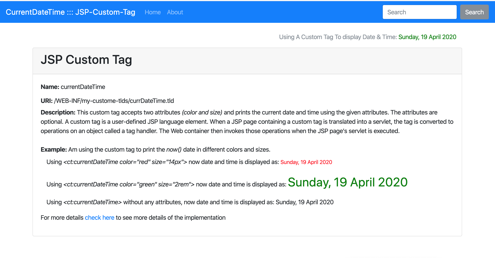

## CurrentDateTime JSP Custom Tag

I created this custom tag to use it in my JSP applications to display day and time specifying the color and font-size.

#### Description
A custom tag is a user-defined JSP language element. When a JSP page containing a custom tag is translated into a servlet, the tag is converted to operations on an object called a tag handler. The Web container then invokes those operations when the JSP page's servlet is executed. This custom tag accepts two attributes `(color and size)` and prints the `current date and time` using the given attributes. The attributes are optional. 

__Name:__ `currentDateTime`

**URI:** `/WEB-INF/my-custom-tlds/currDateTime.tld`

**Example:** 

Using `<ct:currentDateTime color="red" size="14px">` will display `now()` date and time in red color and with size `14px`

Using `<ct:currentDateTime color="green" size="2rem">` will display `now()` date and time in green color with `2rem`

#### To test the custom tag
Clone the repo and run the Apache Tomcat server. Launch the browser with the the root URL.

#### Dependencies
- Java SE 8

- Apache Tomcat 9.0.33

- Preferrably JetBrains IntelliJ IDE

